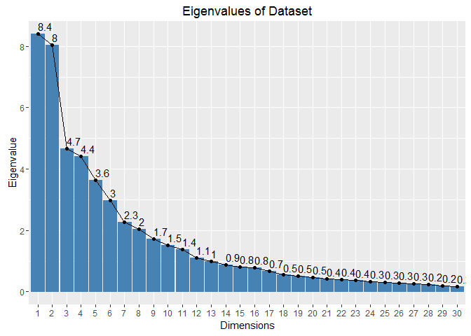

# Machine Learning Project Writeup: Did They Bend It Right?
Edwin Tam  
7 May 2016  


A study of unilateral dumbbell exercise enthusiasts to answer the question: Are they doing the exercise correctly? If not, use a set of datapoints to determine how they do it wrongly.

## Overview 

The Human Activity Recognition Project at Groupware@LES investigated "how well" an activity was performed by accelerometer wearers. They correctly and incorrectly executed an exercise – unilateral dumbbell bicep curls – in 5 different ways and measurements were taken and tabulated. 

This project is meant to predict the way which 6 participants did the exercise by training them against a set of known outcomes (i.e. classe). Measurements are taken from 4 places: waist (belt), arm, forearm, and dumbbell. 


Classe	| Type
--------|----------
A	| Strict form. Correct exercise method
B	| Throwing elbows forward
C | Dumbbells raised halfway up
D | Dumbbells lowered halfway down 
E | Throw hips forward

The rest of this writeup consists of:

1. Review & Clean the Dataset 
2. Prediction Model & Assumptions 
3. Cross-validation and Errors made
4. Conclusion

See Appendix A: Code for the entire program code used in this project.

## 1.	Review & Clean the Dataset 

In a nutshell, there are 159 variables. Of which 8 variables contain user, timestamp, and classe information. The remaining 151 variables measure movement, magnitude and stats at the 4 places. 
In general, these variables include: 

Category | Names
---------|-------------
Direction | Pitch (ptich), yaw, roll, x, y, z
Magnitude | accel, amplitude, max, min
Statistics | Kurtosis, skewness, stddev, var  
Unknown | gyros, magnet

Given the number of variables, I wanted to see if I could reduce the variable set (aka reduce its dimensionality) to make it more manageable. One way of doing so is to use Principal Components Analysis (PCA). In addition, finding out which variables contain most of the data will reduce its dimensionality too.

Actions taken:

A. Remove variables that contain blanks or NA, and the effect of these on the variables  
B. Remove near zero variance variables  
C. Remove descriptor variables  
D. Break up dataset into training and test set  

### A. Remove variables that contain blanks or NA, and the effect of these on the variables


40 variables  contained 2% (406 out of 19,622 values) of all data. Thus we can ignore this set of variables without affecting the predictions too much. 

Dimension size: 60


```r
notEmptyVariables
```

```
##                        X                user_name     raw_timestamp_part_1 
##                    19622                    19622                    19622 
##     raw_timestamp_part_2           cvtd_timestamp               new_window 
##                    19622                    19622                    19622 
##               num_window                roll_belt               pitch_belt 
##                    19622                    19622                    19622 
##                 yaw_belt         total_accel_belt       kurtosis_roll_belt 
##                    19622                    19622                      406 
##      kurtosis_picth_belt        kurtosis_yaw_belt       skewness_roll_belt 
##                      406                      406                      406 
##     skewness_roll_belt.1        skewness_yaw_belt            max_roll_belt 
##                      406                      406                      406 
##           max_picth_belt             max_yaw_belt            min_roll_belt 
##                      406                      406                      406 
##           min_pitch_belt             min_yaw_belt      amplitude_roll_belt 
##                      406                      406                      406 
##     amplitude_pitch_belt       amplitude_yaw_belt     var_total_accel_belt 
##                      406                      406                      406 
##            avg_roll_belt         stddev_roll_belt            var_roll_belt 
##                      406                      406                      406 
##           avg_pitch_belt        stddev_pitch_belt           var_pitch_belt 
##                      406                      406                      406 
##             avg_yaw_belt          stddev_yaw_belt             var_yaw_belt 
##                      406                      406                      406 
##             gyros_belt_x             gyros_belt_y             gyros_belt_z 
##                    19622                    19622                    19622 
##             accel_belt_x             accel_belt_y             accel_belt_z 
##                    19622                    19622                    19622 
##            magnet_belt_x            magnet_belt_y            magnet_belt_z 
##                    19622                    19622                    19622 
##                 roll_arm                pitch_arm                  yaw_arm 
##                    19622                    19622                    19622 
##          total_accel_arm            var_accel_arm             avg_roll_arm 
##                    19622                      406                      406 
##          stddev_roll_arm             var_roll_arm            avg_pitch_arm 
##                      406                      406                      406 
##         stddev_pitch_arm            var_pitch_arm              avg_yaw_arm 
##                      406                      406                      406 
##           stddev_yaw_arm              var_yaw_arm              gyros_arm_x 
##                      406                      406                    19622 
##              gyros_arm_y              gyros_arm_z              accel_arm_x 
##                    19622                    19622                    19622 
##              accel_arm_y              accel_arm_z             magnet_arm_x 
##                    19622                    19622                    19622 
##             magnet_arm_y             magnet_arm_z        kurtosis_roll_arm 
##                    19622                    19622                      406 
##       kurtosis_picth_arm         kurtosis_yaw_arm        skewness_roll_arm 
##                      406                      406                      406 
##       skewness_pitch_arm         skewness_yaw_arm             max_roll_arm 
##                      406                      406                      406 
##            max_picth_arm              max_yaw_arm             min_roll_arm 
##                      406                      406                      406 
##            min_pitch_arm              min_yaw_arm       amplitude_roll_arm 
##                      406                      406                      406 
##      amplitude_pitch_arm        amplitude_yaw_arm            roll_dumbbell 
##                      406                      406                    19622 
##           pitch_dumbbell             yaw_dumbbell   kurtosis_roll_dumbbell 
##                    19622                    19622                      406 
##  kurtosis_picth_dumbbell    kurtosis_yaw_dumbbell   skewness_roll_dumbbell 
##                      406                      406                      406 
##  skewness_pitch_dumbbell    skewness_yaw_dumbbell        max_roll_dumbbell 
##                      406                      406                      406 
##       max_picth_dumbbell         max_yaw_dumbbell        min_roll_dumbbell 
##                      406                      406                      406 
##       min_pitch_dumbbell         min_yaw_dumbbell  amplitude_roll_dumbbell 
##                      406                      406                      406 
## amplitude_pitch_dumbbell   amplitude_yaw_dumbbell     total_accel_dumbbell 
##                      406                      406                    19622 
##       var_accel_dumbbell        avg_roll_dumbbell     stddev_roll_dumbbell 
##                      406                      406                      406 
##        var_roll_dumbbell       avg_pitch_dumbbell    stddev_pitch_dumbbell 
##                      406                      406                      406 
##       var_pitch_dumbbell         avg_yaw_dumbbell      stddev_yaw_dumbbell 
##                      406                      406                      406 
##         var_yaw_dumbbell         gyros_dumbbell_x         gyros_dumbbell_y 
##                      406                    19622                    19622 
##         gyros_dumbbell_z         accel_dumbbell_x         accel_dumbbell_y 
##                    19622                    19622                    19622 
##         accel_dumbbell_z        magnet_dumbbell_x        magnet_dumbbell_y 
##                    19622                    19622                    19622 
##        magnet_dumbbell_z             roll_forearm            pitch_forearm 
##                    19622                    19622                    19622 
##              yaw_forearm    kurtosis_roll_forearm   kurtosis_picth_forearm 
##                    19622                      406                      406 
##     kurtosis_yaw_forearm    skewness_roll_forearm   skewness_pitch_forearm 
##                      406                      406                      406 
##     skewness_yaw_forearm         max_roll_forearm        max_picth_forearm 
##                      406                      406                      406 
##          max_yaw_forearm         min_roll_forearm        min_pitch_forearm 
##                      406                      406                      406 
##          min_yaw_forearm   amplitude_roll_forearm  amplitude_pitch_forearm 
##                      406                      406                      406 
##    amplitude_yaw_forearm      total_accel_forearm        var_accel_forearm 
##                      406                    19622                      406 
##         avg_roll_forearm      stddev_roll_forearm         var_roll_forearm 
##                      406                      406                      406 
##        avg_pitch_forearm     stddev_pitch_forearm        var_pitch_forearm 
##                      406                      406                      406 
##          avg_yaw_forearm       stddev_yaw_forearm          var_yaw_forearm 
##                      406                      406                      406 
##          gyros_forearm_x          gyros_forearm_y          gyros_forearm_z 
##                    19622                    19622                    19622 
##          accel_forearm_x          accel_forearm_y          accel_forearm_z 
##                    19622                    19622                    19622 
##         magnet_forearm_x         magnet_forearm_y         magnet_forearm_z 
##                    19622                    19622                    19622 
##                   classe 
##                    19622
```


### B. Remove near zero variance variables 


PCA works best on variables with a large amount of variance, hence variables with very little variance could be considered as having no effect on the classification. Hene they can be removed. 

Running nearZeroVar() showed 1 variables that had very little variance. This means that we can remove this set of variables as they do not help to predict the outcome. 

Dimension size: 59

### C. Remove descriptor variables


  
Remove the 6 variables ("X", "user_name", "raw_timestamp_part_1", "raw_timestamp_part_2", "cvtd_timestamp", "num_window") used to describe & categorise the dataset as they are not needed to predict an outcome. 

Dimension size: 53 

### 53 Variables to predict on Classe

roll_belt, pitch_belt, yaw_belt, total_accel_belt, gyros_belt_x, gyros_belt_y, gyros_belt_z, accel_belt_x, accel_belt_y, accel_belt_z, magnet_belt_x, magnet_belt_y, magnet_belt_z, roll_arm, pitch_arm, yaw_arm, total_accel_arm, gyros_arm_x, gyros_arm_y, gyros_arm_z, accel_arm_x, accel_arm_y, accel_arm_z, magnet_arm_x, magnet_arm_y, magnet_arm_z, roll_dumbbell, pitch_dumbbell, yaw_dumbbell, total_accel_dumbbell, gyros_dumbbell_x, gyros_dumbbell_y, gyros_dumbbell_z, accel_dumbbell_x, accel_dumbbell_y, accel_dumbbell_z, magnet_dumbbell_x, magnet_dumbbell_y, magnet_dumbbell_z, roll_forearm, pitch_forearm, yaw_forearm, total_accel_forearm, gyros_forearm_x, gyros_forearm_y, gyros_forearm_z, accel_forearm_x, accel_forearm_y, accel_forearm_z, magnet_forearm_x, magnet_forearm_y, magnet_forearm_z, classe

### D.	Break up dataset into training and test set


```r
inTrain <- createDataPartition(pml3$classe, p=0.6, list=FALSE)
pmlTrain <- pml3[inTrain,]
pmlTest <- pml3[-inTrain,]
```


60% of the dataset is used for training with the remainder broken up into test datasets. The respective number of rows in each dataset is:

1. Training set: 11776
2. Test set: 7846


## 2.	Prediction Model and Assumptions

This is essentially a classification problem with supervised learning. I settled on using Random Forest classifier model. At the same time, I will be using PCA to reduce dimensonality. 

A.	Primary Components Analysis 
B.	Random Forest Prediction

### A.	Primary Components Analysis 

As variable Values  are quite diverse. I scale the variables to mean 0 and std deviation of 1 before running PCA. 


There are 12 PCA components with eigenvalues greater than 1 (see Screeplot). These 12 PCA components account for 81% of all variance in the data. Hence we will be using these components in our Random Forest model.


```r
  summary(pml.pca) 
```

```
## Importance of components:
##                           PC1    PC2     PC3     PC4     PC5     PC6
## Standard deviation     2.8991 2.8351 2.16022 2.09904 1.90705 1.72503
## Proportion of Variance 0.1616 0.1546 0.08974 0.08473 0.06994 0.05723
## Cumulative Proportion  0.1616 0.3162 0.40595 0.49068 0.56062 0.61784
##                            PC7     PC8     PC9    PC10    PC11    PC12
## Standard deviation     1.50424 1.43170 1.31491 1.23460 1.17852 1.05200
## Proportion of Variance 0.04351 0.03942 0.03325 0.02931 0.02671 0.02128
## Cumulative Proportion  0.66136 0.70078 0.73403 0.76334 0.79005 0.81133
##                           PC13    PC14    PC15    PC16    PC17    PC18
## Standard deviation     0.99346 0.94182 0.90255 0.88259 0.82241 0.74082
## Proportion of Variance 0.01898 0.01706 0.01567 0.01498 0.01301 0.01055
## Cumulative Proportion  0.83031 0.84737 0.86304 0.87802 0.89102 0.90158
##                          PC19    PC20    PC21   PC22    PC23    PC24
## Standard deviation     0.7175 0.68724 0.63986 0.6329 0.60397 0.57814
## Proportion of Variance 0.0099 0.00908 0.00787 0.0077 0.00701 0.00643
## Cumulative Proportion  0.9115 0.92056 0.92843 0.9361 0.94315 0.94958
##                           PC25    PC26    PC27    PC28    PC29    PC30
## Standard deviation     0.56034 0.54097 0.50586 0.48615 0.44889 0.42221
## Proportion of Variance 0.00604 0.00563 0.00492 0.00455 0.00388 0.00343
## Cumulative Proportion  0.95562 0.96125 0.96617 0.97071 0.97459 0.97801
##                           PC31    PC32    PC33    PC34    PC35    PC36
## Standard deviation     0.37536 0.36473 0.34539 0.33516 0.30300 0.28188
## Proportion of Variance 0.00271 0.00256 0.00229 0.00216 0.00177 0.00153
## Cumulative Proportion  0.98072 0.98328 0.98558 0.98774 0.98950 0.99103
##                           PC37    PC38    PC39    PC40    PC41    PC42
## Standard deviation     0.24864 0.23567 0.23319 0.20089 0.19384 0.18771
## Proportion of Variance 0.00119 0.00107 0.00105 0.00078 0.00072 0.00068
## Cumulative Proportion  0.99222 0.99329 0.99433 0.99511 0.99583 0.99651
##                           PC43    PC44   PC45    PC46    PC47    PC48
## Standard deviation     0.18065 0.17078 0.1619 0.15324 0.14786 0.13910
## Proportion of Variance 0.00063 0.00056 0.0005 0.00045 0.00042 0.00037
## Cumulative Proportion  0.99714 0.99770 0.9982 0.99865 0.99907 0.99945
##                           PC49    PC50    PC51    PC52
## Standard deviation     0.11315 0.08899 0.07706 0.04632
## Proportion of Variance 0.00025 0.00015 0.00011 0.00004
## Cumulative Proportion  0.99969 0.99984 0.99996 1.00000
```

```r
  fviz_screeplot(pml.pca, ncp=30, choice="eigenvalue", addlabels=TRUE) + labs(title = "Eigenvalues of Dataset")
```

<!-- -->


### B.	Random Forest Model

Now that we have our PCA components. It's time to create the Random Forest Model.The code below shows how we'd use our PCA Components to create & train the model - rfFit.

This required 34.7 minutes to execute. 


```r
# Random Forest with PCA
trans = preProcess(scale.pmlTrain, method="pca", pcaComp = 13)
trainPC = predict(trans, scale.pmlTrain)

# build the random forest model 
rfFit = train(pmlTrain$classe~., method="rf", data=trainPC)
```


### C. How Accurate is it?


Now the Test set (*pml.test*, 40% of the dataset) is used to get an idea of the model's accuracy. This is shown in the confusion matrix below. It is 92.84% accurate.


```r
cm
```

```
## Confusion Matrix and Statistics
## 
##           Reference
## Prediction    A    B    C    D    E
##          A 2139   37   24    7   25
##          B   47 1426   20   12   13
##          C   33   93 1194   27   21
##          D   36    6   89 1147    8
##          E    2   27   10   25 1378
## 
## Overall Statistics
##                                          
##                Accuracy : 0.9284         
##                  95% CI : (0.9224, 0.934)
##     No Information Rate : 0.2877         
##     P-Value [Acc > NIR] : < 2.2e-16      
##                                          
##                   Kappa : 0.9093         
##  Mcnemar's Test P-Value : < 2.2e-16      
## 
## Statistics by Class:
## 
##                      Class: A Class: B Class: C Class: D Class: E
## Sensitivity            0.9477   0.8974   0.8930   0.9417   0.9536
## Specificity            0.9834   0.9853   0.9733   0.9790   0.9900
## Pos Pred Value         0.9583   0.9394   0.8728   0.8919   0.9556
## Neg Pred Value         0.9790   0.9742   0.9779   0.9892   0.9895
## Prevalence             0.2877   0.2025   0.1704   0.1552   0.1842
## Detection Rate         0.2726   0.1817   0.1522   0.1462   0.1756
## Detection Prevalence   0.2845   0.1935   0.1744   0.1639   0.1838
## Balanced Accuracy      0.9655   0.9414   0.9332   0.9604   0.9718
```

### D. Out-of-sample error rate


The Out-of-Sample Error Rate is simply 100% - model accuracy. It stands at 7.15%. 


```r
missClass = function(values, predicted) { sum(predicted != values) / length(values)}
OOS_errRate = missClass(pmlTest$classe, predict(rfFit, testPC))
```


## Conclusion

This model correctly predicted 20 observations of the testing data set from the Project Submission Page. 

However, two things stood out: 

1. The Error Rate seems quite high (7.15%)
2. It took a long while to generate this model (34.7 min)

Instead of using PCA to reduce dimensionality, I'd like to explore other ways to reduce the variable set without sacrificing accuracy and speed. 


## Appendix A: Program Code


```r
## Program Code

library(xlsx)
library(caret)

pml <- read.csv("data/pml-training.csv")

# What's in pml?
# Summary, head, structure (str) 

head(pml)
summary(pml)
str(pml)

## Find columns that have near zero variance 

nzv <- nearZeroVar(pml)
length(nzv) 

pml1 <- pml[,-nzv]

# Which columns have lots of NAs and empty values? 
#a <- apply (pml, 2, function(col) {
#  sum(!is.na(col)) 
#})

notEmptyVariables <- apply (pml1, 2, function(col) {
  sum(col !="", na.rm = TRUE) 
})

## for review >> write.xlsx(b, "data/na2.xlsx")

## 100 vars have lots of NAs & empty values (about 98% of the column is NA). What's the effect on Classe?
# Ans: Unlikely. Because of... the spread of classe? Why and how can you say so?
## Not accurate >> Some columns (e.g. Kurtosis do not have NAs but blanks)

#table(pml[!is.na(pml$max_yaw_arm),]$classe)

# Removing columns with names from emptyVariables 
namesToKeep <- names(notEmptyVariables[notEmptyVariables!=406])
pml2 <- pml1[namesToKeep]


# C. Remove descriptor variables

pml3 <- pml2[, !(colnames(pml2) %in% c("X", "user_name", "raw_timestamp_part_1", "raw_timestamp_part_2", "cvtd_timestamp", "num_window"))]


# D. Break up into training and test sets

inTrain <- createDataPartition(pml3$classe, p=0.6, list=FALSE)
pmlTrain <- pml3[inTrain,]
pmlTest <- pml3[-inTrain,]

nrow(pmlTrain)
nrow(pmlTest)

# Find PCA 
scale.pmlTrain <- scale(pmlTrain[,1:52])
pml.pca <- prcomp(scale.pmlTrain, center = TRUE, scale. = TRUE) 

print(pml.pca)
summary(pml.pca) 
plot(pml.pca, type = "l")

# Random Forest with PCA
trans = preProcess(scale.pmlTrain, method="pca", pcaComp = 12)
trainPC = predict(trans, scale.pmlTrain)

# build the random forest model 
rfFit = train(pmlTrain$classe~., method="rf", data=trainPC)

## Testing RF model on test dataset
# scale test dataset 
scale.pmlTest <- scale(pmlTest[,1:52])

# Predict classe with preprocessed trans on PMLTest
testPC = predict(trans, scale.pmlTest)

# confusion matrix to get accuracy of RF model on test data
confusionMatrix(pmlTest$classe, predict(rfFit, testPC))
```
